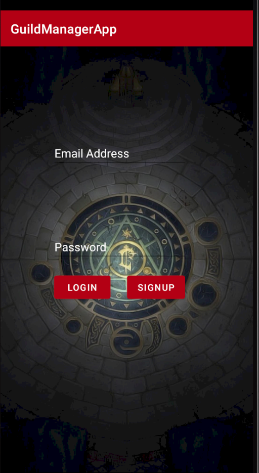
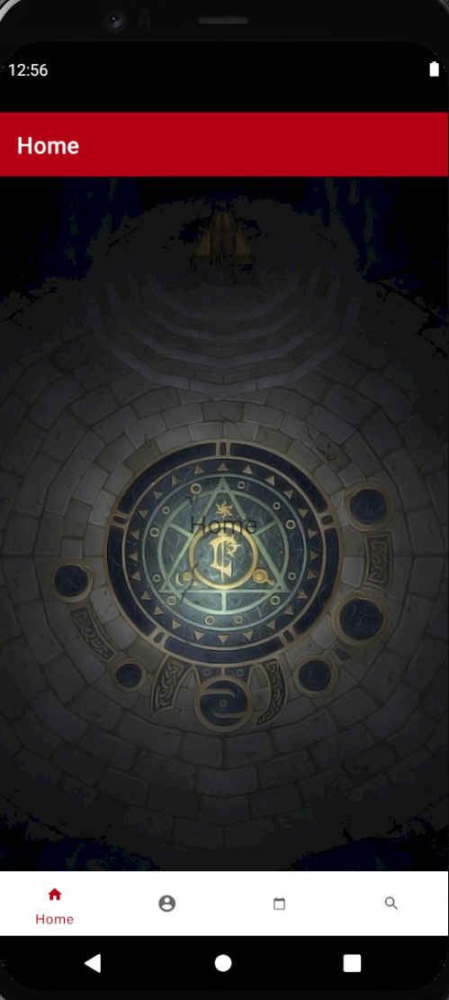
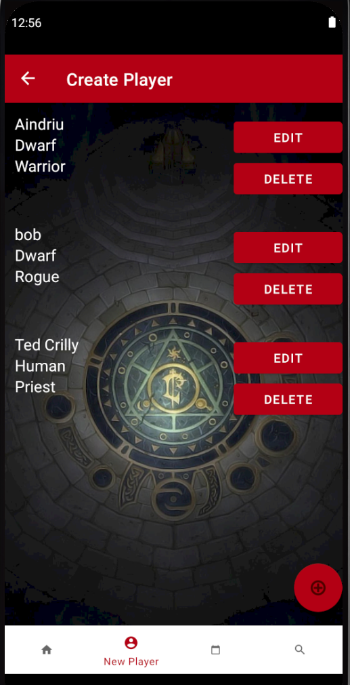
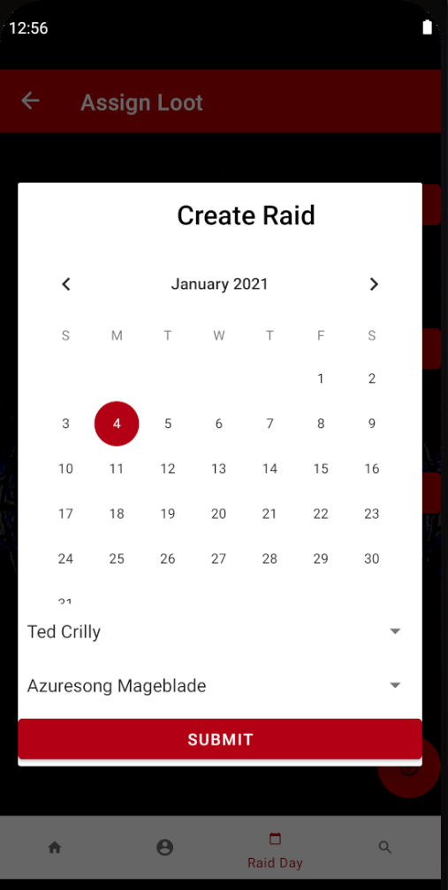

# GuildAppManager

This application is inspired by my role as Loot Council Member in a World Of Warcraft guild. This role involves awarding loot to players who attend guild raid events.
With this application users can register accounts through Firebase Auth and then once registered they can create, edit and delete characters and items in the
Firebase Realtime Database. The data is protected so each user will only be able to access their own data.

In the future I would like to possibly draw upon the Wowhead Item API and use that to populate an Item DB, this would offer richer item selection, as well as access to images
and thumbnails

## Startup view

## Main Activity Homepage

## Create Player View

## Create Raid Popup

Background image credit - <https://wallpaperaccess.com/warcraft-phone>